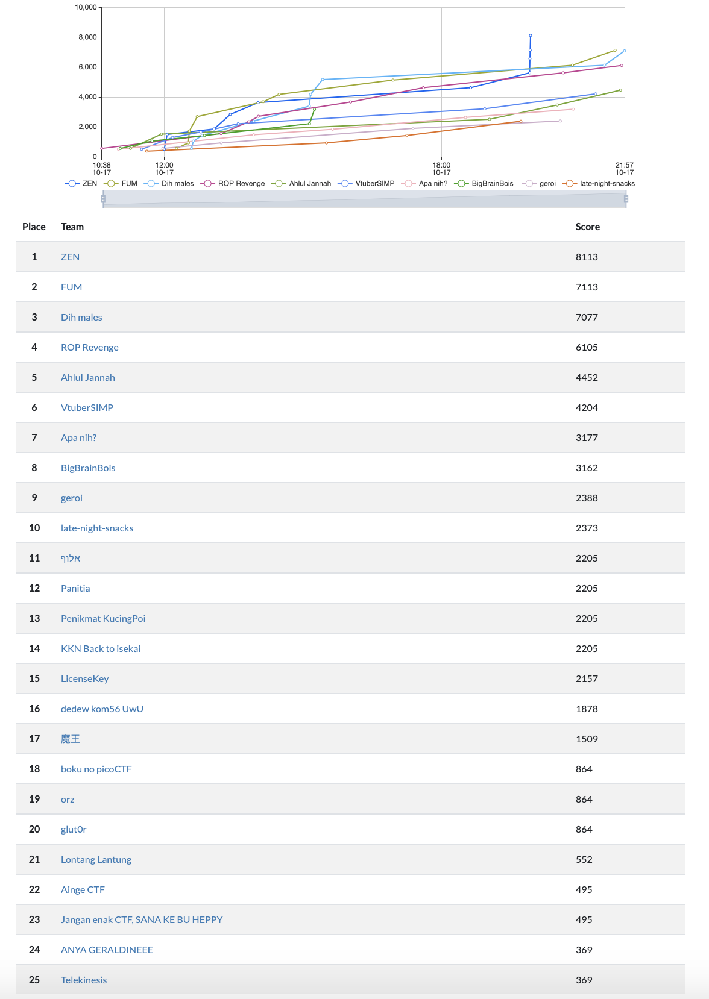

#  Cyber Jawara 2020 Final (Jeopardy) - Problemset

Cyber Jawara is an annual national cyber security competition in Indonesia. The final competition for Cyber Jawara 2020 was held online due to the COVID-19 situation.

This repository contains the problemset for Cyber Jawara 2020 Final.

## Final Scoreboard

## List of Problems

|Name                   | Category    |Problem Setter     |
|-----------------------|---------------|----------------------------|
| [Toko Masker 4](https://github.com/farisv/CJ2020-Final-CTF/tree/master/web/toko-masker-4) | Web | Fariskhi |
| [WHO](https://github.com/farisv/CJ2020-Final-CTF/tree/master/web/who) | Web | Fariskhi |
| [COVID-19 Statistics](https://github.com/farisv/CJ2020-Final-CTF/tree/master/web/covid19-statistics) | Web | Visat |
| [Tic Tac Toe](https://github.com/farisv/CJ2020-Final-CTF/tree/master/web/tic-tac-toe) | Web | Visat |
| [CJ Travel](https://github.com/farisv/CJ2020-Final-CTF/tree/master/web/cj-travel) | Web | Visat & Fariskhi |
| [No Syscall](https://github.com/farisv/CJ2020-Final-CTF/tree/master/pwn/no-syscall) | Pwn | Fariskhi |
| [Maze Solver](https://github.com/farisv/CJ2020-Final-CTF/tree/master/pwn/maze-solver) | Pwn | Fariskhi |
| [Sorting Game](https://github.com/farisv/CJ2020-Final-CTF/tree/master/pwn/sorting-game) | Pwn | Fariskhi |
| [Lab Virus](https://github.com/farisv/CJ2020-Final-CTF/tree/master/pwn/lab-virus) | Pwn | Fariskhi |
| [Airport System](https://github.com/farisv/CJ2020-Final-CTF/tree/master/pwn/airport-system) | Pwn | Fariskhi |
| [Suspicious](https://github.com/farisv/CJ2020-Final-CTF/tree/master/re/suspicious) | RE | Fariskhi |
| [Malware](https://github.com/farisv/CJ2020-Final-CTF/tree/master/re/malware) | RE | Visat |
| [Inothing](https://github.com/farisv/CJ2020-Final-CTF/tree/master/re/inothing) | RE | Visat |

## Solutions

This is the [after-event presentation slides](https://github.com/farisv/CJ2020-Final-CTF/blob/master/%5BBahasa%20Indonesia%5D%20Final%20Cyber%20Jawara%202020%20-%20Statistik%20%26%20Solusi.pdf) about the statistics & solutions of each challenge (in Indonesian language).
